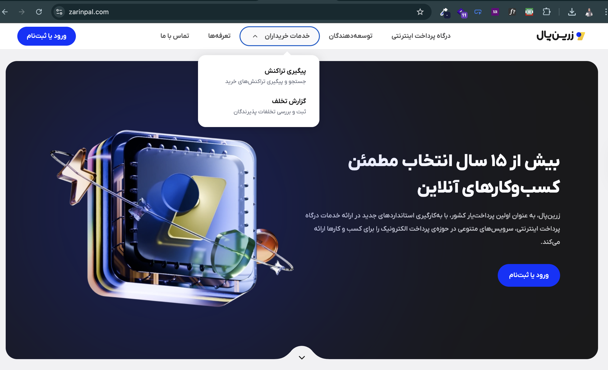

# Zarinpal Responsive Practice

A simple responsive webpage inspired by Zarinpal.  
Made for practicing **HTML, CSS, and Responsive Design**.

## 📱 Features
- Mobile menu (hamburger)
- Responsive layout (mobile, tablet, desktop)
- Sticky navbar with blur effect

## 🖼️ Screenshots

  

## 🛠️ Technologies
- HTML5
- CSS3 (Flexbox, Media Queries)
- JavaScript (for hamburger menu)

## 👨‍💻 How to run
Just open `index.html` in your browser.

---

*Practice project – not official Zarinpal website.*